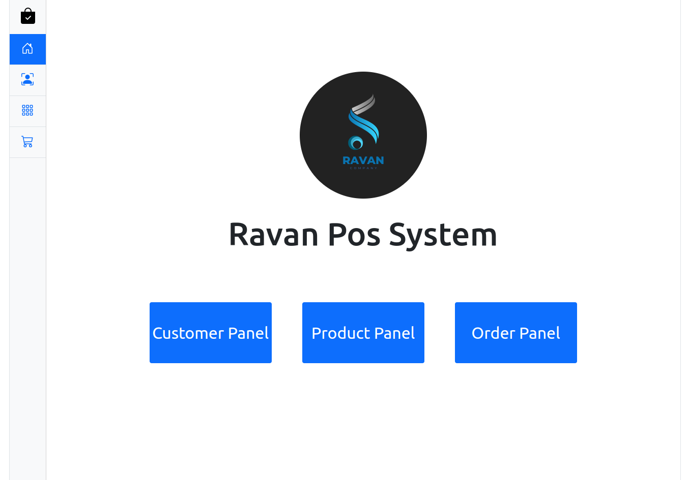
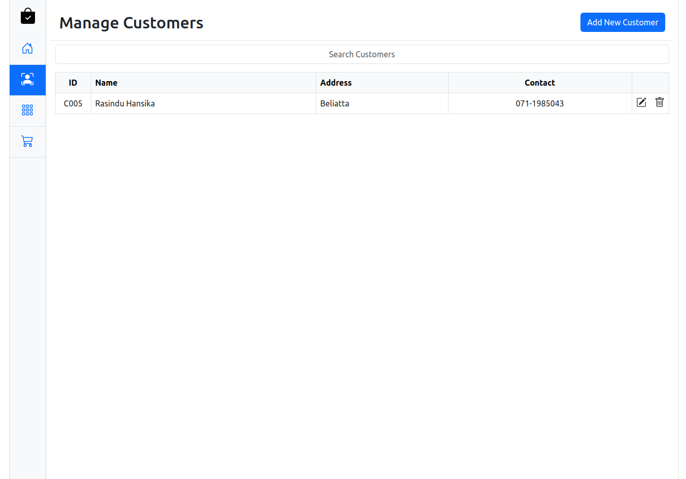
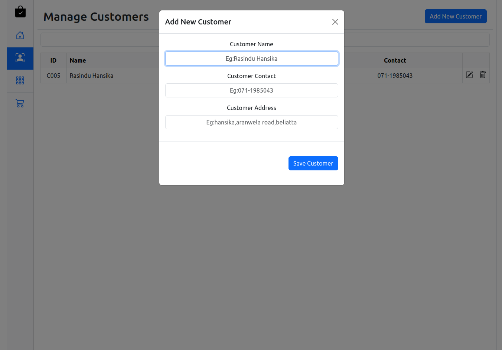
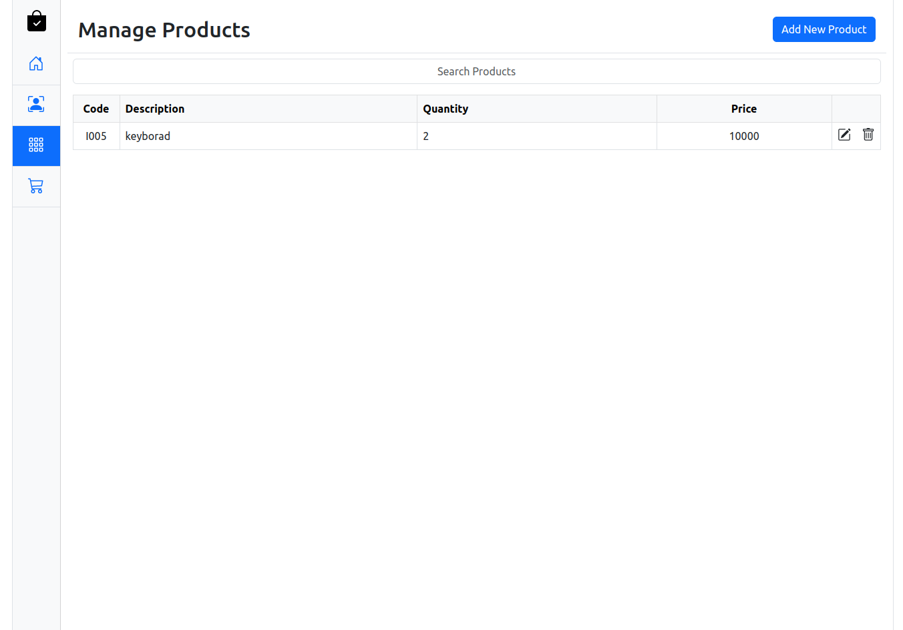
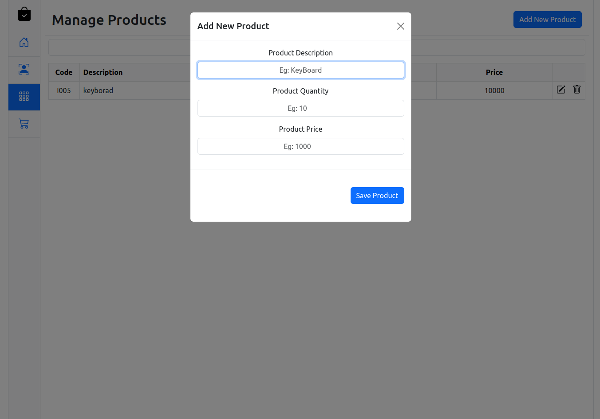
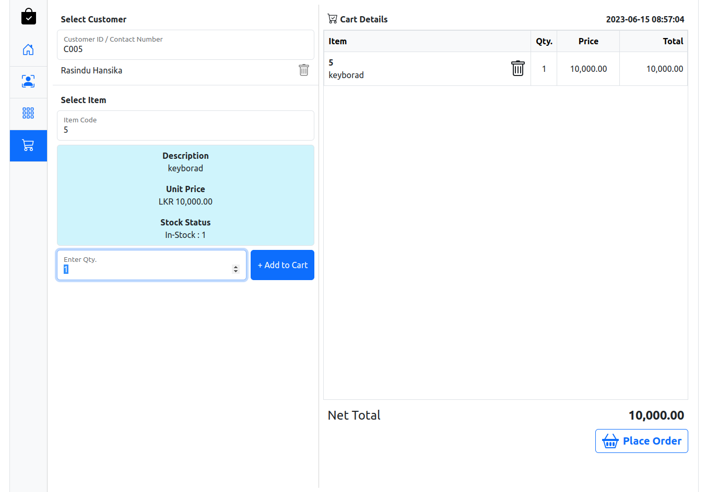
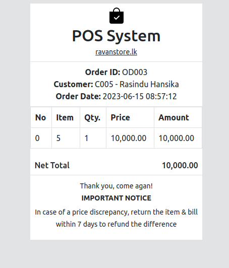

# Point of Sale (POS) System

A comprehensive Point of Sale (POS) system that allows administrators to efficiently manage customer, item, and order information. The system includes features such as adding, removing, updating, saving, and finding customers, items, and orders. It also generates bills for seamless checkout experiences. All data is securely stored in a robust database, ensuring data integrity and quick access. The POS system is customizable to meet various industry needs, offering functionalities such as adding new customers and items, updating information, and managing orders. 
#

<div style="display:flex ">







</div>

## Features

- Customer Management: Add, remove, update, and find customers in the system.
- Product Management: Add, remove, and update products available for sale.
- Order Management: Create and manage order details while generating bills.
- Database Integration: All data is stored in a MySQL database.

## Technologies Used

### Front-end Technologies

- HTML5
- CSS3
- JavaScript
- Bootstrap
- jQuery
- AJAX
- Web API
- big.js
- animate.css
- js-joda

### Back-end Technologies

- Java 11
- Spring Web MVC
- Lombok
- Jackson
- MySQL
- Apache DBCP

## Installation

Clone the repository or download the source code.

```shell
git clone https://github.com/Rasindu-Hansika/POS-System.git
